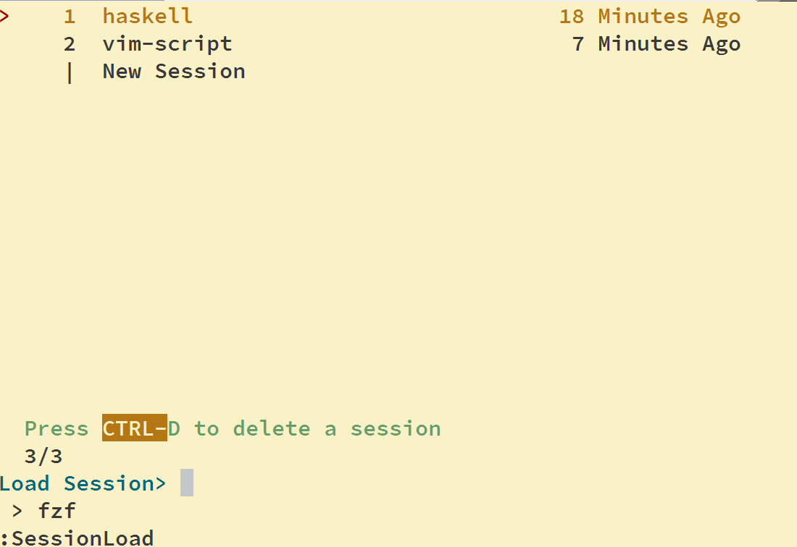

Simple session loader that works with fzf. Sessions are stored in ~/.vim/sessions .

- Enter on [New session] creates a new session
- Enter selects an existing session. This unloads all buffers of the current session and loads the new one
- Ctrl-d deletes all selected session files.

If you want to run this in your vimrc on startup you need some slight trickery:

    if (!exists('g:first_load'))
        if v:vim_did_enter
          SessionLoad
        else
         au VimEnter * SessionLoad
        endif
    endif
    let g:first_load = v:false

## Installation:

With vim-plug:

    Plug 'Tarmean/fzf-session.vim'
    Plug 'tpope/vim-obsession'
    Plug 'junegunn/fzf', { 'dir': '~/.fzf', 'do': 'yes \| ./install' }
    let g:obsession_no_bufenter = 1

The plugin works perfectly fine without vim-obsession but you won't automatically store the session when quitting vim.

## Note:

Whe using SessionLoad to switch we

- unload all current buffers
- close all windows 
- wipe all terminals

If you have any unsaved buffers they are left loaded.

Terminal buffers can't be restored so it would be sensible to give them the same treatment. But neovim recreates terminal buffers as empty when opening a terminal session so if we switch between sessions a bunch we get an exponential count of terminal buffers.

As a band aid fix terminals are killed when switching sessions. To avoid this behavior use:

    let g:session#unload_old_sessions = 0
